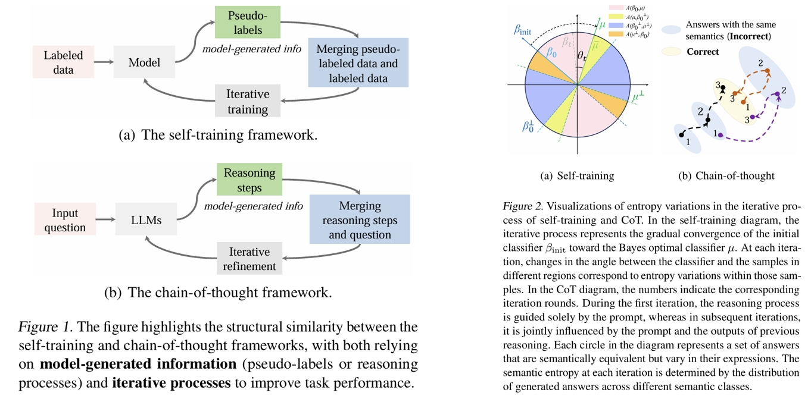
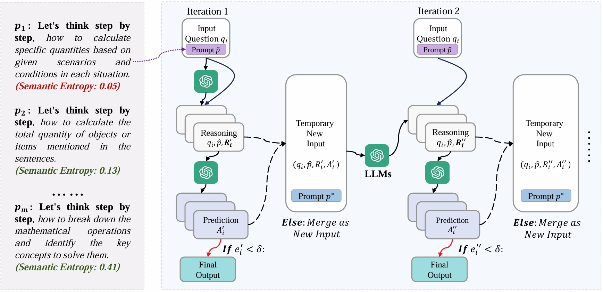
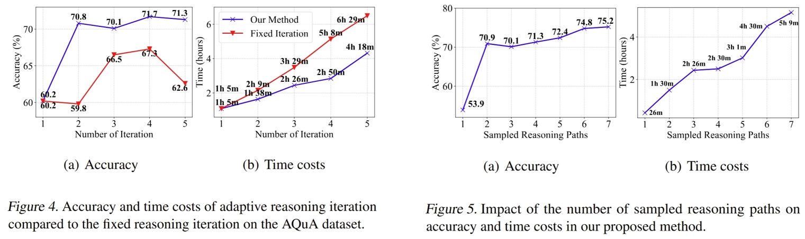

# Rethinking Chain-of-Thought from the Perspective of Self-Training

This is the official implementation of `Rethinking Chain-of-Thought from the Perspective of Self-Training`.

[//]: # (The paper is available at [arXiv]&#40;https://arxiv.org/abs/2205.11916&#41;.)
The paper is available at [arXiv](https://arxiv.org/abs/2412.10827).


<div align="center">

</div>

<div align="center">

</div>


## Installation
Make sure you have Python>=3.8 installed on your machine.
```
pip install torch==1.8.2+cu111 torchtext==0.9.2 -f https://download.pytorch.org/whl/lts/1.8/torch_lts.html
pip install -r requirements.txt
```

## Set your OpenAI API key
```
client = OpenAI(
    api_key="YOUR OPENAI API KEY",
    base_url="https://api.chatanywhere.tech/v1"
)
```

## Quick Start

### Zero-shot-CoT + Self-consistency + Our
```
python main.py --cot_trigger=1 --dataset=aqua --limit_dataset_size=30
```

### Zero-shot-CoT + Self-consistency
```
python comparison.py --method=zero_shot_cot --cot_trigger=1 --dataset=aqua --limit_dataset_size=30
```

### Zero-shot + Self-consistency
```
python comparison.py --method=zero_shot --cot_trigger=1 --dataset=aqua --limit_dataset_size=30
```

### A Demo Example
_**Question**_: \
A car is being driven, in a straight line and at a uniform speed, towards the base of a vertical tower. The top of the tower is observed from the car and, in the process, it takes 10 minutes for the angle of elevation to change from 45° to 60°. After how much more time will this car reach the base of the tower? Answer Choices: (A) 5 (√3 + 1)  (B) 6 (√3 + √2)  (C) 7 (√3 – 1)  (D) 8 (√3 – 2)  (E) None of these.


*****************************
_**Setting:**_
1) Maximum number of iteration rounds = 3
2) The number of self-consistency = 3
3) Semantic entropy threshold = 0

_**Note:** This implies that in the current CoT iteration, all three predictions (from three self-consistency samples) must be consistent to terminate the iteration and avoid proceeding to the next round. If a new iteration begins, the three reasoning processes are updated based on the results from the previous round._

*****************************

_**Filtered Predictions**_:\
pre_first_list:  ['C', 'A', 'B'] \
pre_two_list:  ['E', 'A', 'A'] \
pre_three_list:  ['A', 'A', 'A'] 

**Last_pred** : A \
**Ground Truth** : A


*****************************

### Partial Experiment


| **Method**                  | **MultiArith** | **GSM8K** | **SingleEq** | **AddSub** | **AQuA** | **SVAMP** |
|-----------------------------|----------------|-----------|--------------|------------|----------|-----------|
| Zero-Shot                  | 51.2           | 10.8      | 62.4         | 56.7       | 38.6     | 56.3      |
| Zero-Shot-CoT              | 92.8           | 74.7      | 84.4         | 74.7       | 55.5     | 77.0      |
| Zero-Shot-CoT + SC         | 95.7           | 79.2      | 88.8         | 81.3       | 63.0     | 82.2      |
| + **TSP** | **97.0** (+1.3) | **81.1** (+1.8) | **90.0** (+1.2) | **84.8** (+3.5) | **65.7** (+2.7) | **85.5** (+3.3) |
| + **ARI** | **96.7** (+1.0) | **82.6** (+3.4) | **92.1** (+3.3) | **87.1** (+5.8) | **69.3** (+6.3) | **87.1** (+4.9) |
| + **TSP + ARI** | **98.2** (+2.5) | **83.0** (+3.8) | **92.9** (+4.1) | **88.4** (+7.1) | **70.1** (+7.1) | **87.5** (+5.3) |

**Table:** Accuracy (%) across six arithmetic datasets from zero-shot reasoning tasks. The number of self-consistency (SC) sampling is fixed at 3 for all cases. Values in parentheses indicate performance increases compared to the "Zero-Shot-CoT + SC" method.

<div align="center">

</div>

*****************************


## Citation
```
@article{wu2024rethinking,
  title={Rethinking Chain-of-Thought from the Perspective of Self-Training},
  author={Wu, Zongqian and Xu, Baoduo and Cui, Ruochen and Zhan, Mengmeng and Zhu, Xiaofeng and Feng, Lei},
  journal={arXiv preprint arXiv:2412.10827},
  year={2024}
}
```
